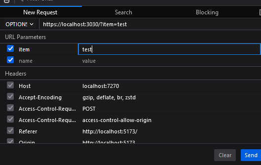

# ToDo API

My first API made with C# and .NET Core. This API is a simple to-do list API that allows you to create, read, update and delete tasks.

To run this, please use Visual Studio and run the `Program.cs` file
